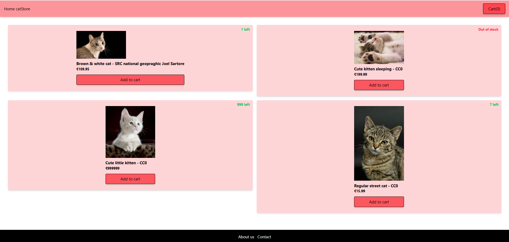
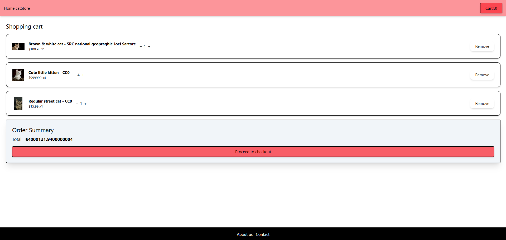

#

#

#

# Angular E‑Commerce

A modern  e-commerce front-end built with Angular (v19), TypeScript, Angular Material & RxJS. This project showcases a responsive product catalog, shopping cart workflow, and integration with a RESTful API.

## Table of Contents

* [🔧 Installation](#-installation)
* [💡 Usage](#-usage)
* [✨ Features](#-features)
* [🛠️ Tech Stack](#️-tech-stack)
* [📸 Screenshots](#-screenshots)
* [🤝 Contributing](#-contributing)
* [✉️ Contact](#️-contact)
* [📄 License](#-license)

---

## 🔧 Installation

1. **Clone the repository**

   ```bash
   git clone https://github.com/DaemoniaX/Angular-Ecommerce.git
   cd Angular-Ecommerce
   ```
2. **Install dependencies**

   ```bash
   npm install
   ```
3. **Serve locally**

   ```bash
   ng serve --open
   ```

> The application will run at `http://localhost:4200` by default.

### Environment Variables

Configure API endpoints in `src/environments/environment.ts`:

```ts
export const environment = {
  production: false,
  apiUrl: 'https://api.yourdomain.com'
};
```

---

## 💡 Usage

* Navigate the product catalog
* View product details
* Add/remove items in the shopping cart
* Proceed through the checkout flow

Additional commands:

* **Run unit tests**: `npm run test`
* **Build for production**: `npm run build`

---

## ✨ Features

* Responsive UI with Angular Material
* Reactive forms and state management via RxJS
* Product catalog pagination and filtering
* Shopping cart persistent across sessions
* Integration with RESTful API for CRUD operations

---

## 🛠️ Tech Stack

* **Framework**: Angular v19
* **Language**: TypeScript
* **UI Library**: Angular Material
* **State Management**: RxJS
* **Styling**: TailWind css

---

## 📸 Screenshots

---


---

## 🤝 Contributing

Contributions, issues and feature requests are welcome! Please feel free to:

* Fork the repository
* Create an issue for bugs or enhancements
* Submit a pull request

---

## ✉️ Contact

**Name**: Antonin Marolleau
**School**: ESIEE Paris – Integrated Engineering Program second year
**Email**: [antonin.marolleau@edu.esiee.fr](mailto:antonin.marolleau@edu.esiee.fr)
**LinkedIn**: [https://www.linkedin.com/in/antonin-marolleau-7b5497339](https://www.linkedin.com/in/antonin-marolleau-7b5497339)

---

## 📄 License

This project is licensed under the CC0 License.
